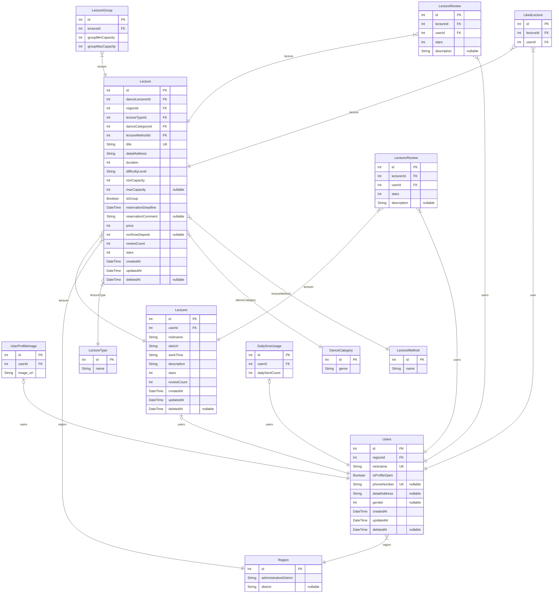

# 💃connection-backend🕺
- 댄스 클래스 중개 플렛폼 connection입니다.

 
  
## 🛠Member

| **김현수** | **이재현** |
| :------: |  :------: |
| [   @0119Kimsoo](https://github.com/0119Kimsoo) | [   @Cheorizzang](https://github.com/Cheorizzang) |

 

    <h1>📚 TECH STACKS</h1>
    <ul>
      <h3>Back-end</h3>
      
      
      
      
      
      
      
       
      <h3>Cloud</h3>
      
      
      
       
      <h3>CI/CD</h3>
      
      
    </ul>
  

  
    
  
  

    <h1>📄 ERD</h1>
    # Prisma Markdown
Generated by [`prisma-markdown`](https://github.com/samchon/prisma-markdown)

 

## 💰 Payment Flow

 

## 🔍 Search Server Data Flow

 

## 🤖 CI/CD Flow

 

 

  

    
  

    <h1>📜 Commit Convention </h1>
    <ul>
      - `feat` : 새로운 기능 추가  
      - `fix` : 버그 수정   
      - `docs` : 문서 수정   
      - `style` : 코드 포맷팅, 세미콜론 누락, 코드 변경이 없는 경우   
      - `refactor` : 코드 리펙토링   
      - `test` : 테스트 코드, 리펙토링 테스트 코드 추가   
      - `chore` : 빌드 업무 수정, 패키지 매니저 수정   
      - `conflict`: 충돌 해결   
     </ul>
  

