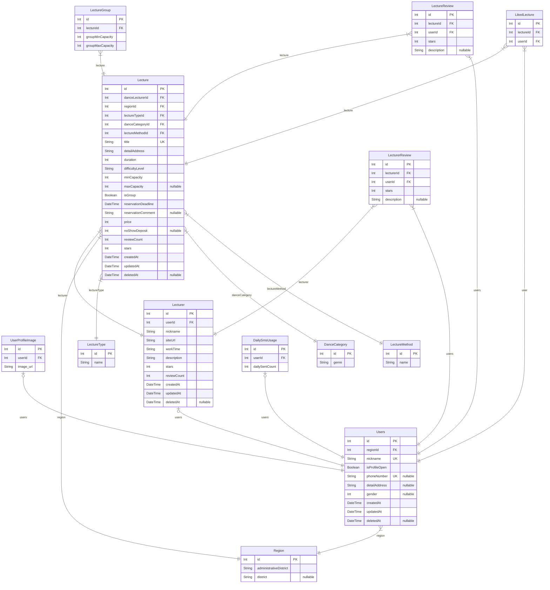

  

 

## 🔎 서비스 소개

> 댄서와 수강생을 매칭 서비스, 『 CONNECTION 』

수강생들에게는 간편한 댄스 수업 검색부터 비교까지, 그리고 강사들에게는 클래스 예약부터 종합적인 관리 및 홍보 서비스까지 제공합니다. 
본 서비스는 사용자의 요구를 파악하기 위해 설문조사를 기반으로 기획되었으며,  
댄스 수업 정보의 불균형을 해소하고 수요와 공급 사이의 연결을 강화하는 것이 핵심 목표입니다.

 

## 🛠Member

| **김현수** | **이재현** |
| :------: |  :------: |
| [   @Kimsoo0119](https://github.com/Kimsoo0119) | [   @j-zzi](https://github.com/j-zzi) |

## ✨ 주요 기능

### 회원

| **클래스 탐색**                          | **클래스 커리큘럼&리뷰**                         |
| :--------------------------------------------------------------------: | :-----------------------------------: |
|  |  |
|
**간편한 신청**
                    |                         |
|  | |

### 강사

| **클래스 등록**                          | **패스권/쿠폰 생성**                         |
| :--------------------------------------------------------------------: | :-----------------------------------: |
|  |  |
|
**수강생 모집**
                    | **신청한 수강생 확인**                        |
|  |  |

 

    <h1>📚 TECH STACKS</h1>
    <ul>
      <h3>Back-end</h3>
      
      
      
      
      
      
      
       
      <h3>Cloud</h3>
      
      
      
       
      <h3>CI/CD</h3>
      
      
    </ul>
  

  
    
  
  

    <h1>📄 ERD</h1>
    # Prisma Markdown
Generated by [`prisma-markdown`](https://github.com/samchon/prisma-markdown)

```mermaid
erDiagram
Users {
    Int id PK
    Int regionId FK
    String nickname UK
    Boolean isProfileOpen
    String phoneNumber UK "nullable"
    String detailAddress "nullable"
    Int gender "nullable"
    DateTime createdAt
    DateTime updatedAt
    DateTime deletedAt "nullable"
}
UserProfileImage {
    Int id PK
    Int userId FK
    String image_url
}
Region {
    Int id PK
    String administrativeDistrict
    String district "nullable"
}
Lecturer {
    Int id PK
    Int userId FK
    String nickname
    String siteUrl
    String workTime
    String description
    Int stars
    Int reviewCount
    DateTime createdAt
    DateTime updatedAt
    DateTime deletedAt "nullable"
}
Lecture {
    Int id PK
    Int danceLecturerId FK
    Int regionId FK
    Int lectureTypeId FK
    Int danceCategoryId FK
    Int lectureMethodId FK
    String title UK
    String detailAddress
    Int duration
    String difficultyLevel
    Int minCapacity
    Int maxCapacity "nullable"
    Boolean isGroup
    DateTime reservationDeadline
    String reservationComment "nullable"
    Int price
    Int noShowDeposit "nullable"
    Int reviewCount
    Int stars
    DateTime createdAt
    DateTime updatedAt
    DateTime deletedAt "nullable"
}
LectureGroup {
    Int id PK
    Int lectureId FK
    Int groupMinCapacity
    Int groupMaxCapacity
}
DanceCategory {
    Int id PK
    String genre
}
LectureType {
    Int id PK
    String name
}
LectureReview {
    Int id PK
    Int lectureId FK
    Int userId FK
    Int stars
    String description "nullable"
}
LecturerReview {
    Int id PK
    Int lecturerId FK
    Int userId FK
    Int stars
    String description "nullable"
}
DailySmsUsage {
    Int id PK
    Int userId FK
    Int dailySentCount
}
LectureMethod {
    Int id PK
    String name
}
LikedLecture {
    Int id PK
    Int lectureId FK
    Int userId FK
}
Users }|--|| Region : region
UserProfileImage |o--|| Users : users
Lecturer |o--|| Users : users
Lecture }|--|| Lecturer : lecturer
Lecture }|--|| Region : region
Lecture }|--|| LectureType : lectureType
Lecture }|--|| DanceCategory : danceCategory
Lecture }|--|| LectureMethod : lectureMethod
LectureGroup }|--|| Lecture : lecture
LectureReview }|--|| Lecture : lecture
LectureReview }|--|| Users : users
LecturerReview }|--|| Lecturer : lecturer
LecturerReview }|--|| Users : users
DailySmsUsage |o--|| Users : users
LikedLecture }|--|| Lecture : lecture
LikedLecture }|--|| Users : user
```

 

## 💰 Payment Flow

## 🔍 Search Server Data Flow

 

## 🤖 CI/CD Flow

 

 

  

    
  

    <h1>📜 Commit Convention </h1>
    <ul>
      - `feat` : 새로운 기능 추가  
      - `fix` : 버그 수정   
      - `docs` : 문서 수정   
      - `style` : 코드 포맷팅, 세미콜론 누락, 코드 변경이 없는 경우   
      - `refactor` : 코드 리펙토링   
      - `test` : 테스트 코드, 리펙토링 테스트 코드 추가   
      - `chore` : 빌드 업무 수정, 패키지 매니저 수정   
      - `conflict`: 충돌 해결   
     </ul>
  

